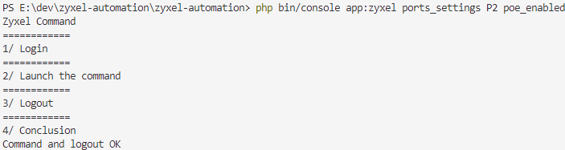
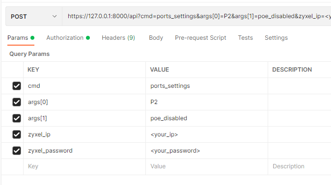
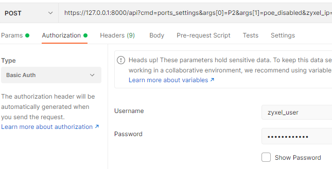

# ZYXEL-AUTOMATION #

The switch GS1200_5HP is a good switch with POE, but it doesn't provide an API system to automate actions.

So, this program allow to control remotely the ports of a Zyxel's switch GS1200_5HP.

This program should work with the GS1200_8HP but is has not been tested.

## Basic usage ##

You need to clone this repository and then you have two methods in order to control your switch : directly with the command line or via http request with the provided API server.

### The command line ###

After cloning this repository, this program is a symfony project, so you need to : 
* install all the prerequisites for having a functional Symfony 6 project working in your system (see https://symfony.com/doc/current/setup.html)
* install the dependencies with the command **composer install**
* customize your own parameters in the file **.env.local** (create a copy of the .env file)

  | Parameter | Type | Description |
  |-----------|------|-------------|
  |   APP_ZYXEL_SWITCH_IP     |  String    | IP or FQDN of the switch (default by the manufacturer 192.168.1.3)           |
  |   APP_ZYXEL_PASSWORD      |  String    | The switch password            |
  |   APP_ZYXEL_DEVICE        |  String    | The type of the switch (**5HP** = 5 ports or **8HP** = 8 ports)            |
  |   APP_ZYXEL_USER_PASSWORD |  String    | Only if you want to use the API system with http request, that will be the password of the API system. The password need to be crypted with the best available hasher judged by Symfony (currently Bcrypt)|  

The values (APP_ZYXEL_switch_IP, APP_ZYXEL_PASSWORD and APP_ZYXEL_DEVICE) in the **.env.local** file are optional and set default values, in fact you can override these settings directly in the command line (or in the http request), so you can handle multiple switchs.  

***Example of commands***

__Help command :__
The help command allow to see how use this tool 
```
php bin/console app:zyxel --help
```

__Ports settings command :__
Currently, only the ports management of the switch is possible. Ports management is possibler with the key **ports_settings**.
For each port, you can set :
* the state of the port (_state_enabled_ = The port is enabled / _state_disabled_ = The port is disabled ), 
* the flow of the port (_flow_ctl_enabled_ = The flow is enabled / _flow_ctl_disabled_ = The flow is disabled ),  
* if POE is enabled (_poe_enabled_ = The POE is enabled / _poe_disabled_ = The POE is disabled )
* and the speed (_speed_10_ = 10Mb/s, _speed_100_ = 100Mb/s, _speed_auto_ = automatic speed).


Defaults values of the ports_settings : state_enabled flow_ctl_disabled poe_enabled speed_auto
A special argument _all_default_ exist and set the default value for all ports or a specific port.

If no values is set for a port, automatically it will receive the default values.
        
<u>Examples : </u>

```
# Port 1 with all default and P2 with specific values
php bin/console app:zyxel ports_settings P1 all_default P2 state_enabled flow_ctl_enabled poe_enabled speed_10
# Disabled POE on Port 2 (others values with default and all others ports have default values)
php bin/console app:zyxel ports_settings P2 poe_disabled
# Disabled POE on Port 2 on a specific switch
php bin/console app:zyxel --ip=<switch_ip> --password=<switch_password> --device=5HP ports_settings P2 poe_disabled
```

_Output example :_




### API ###

If you want to control remotely your system via an API (for example with home assistant, or with a random domotic system), it's possible.

You need to setup a WebServer with PHP and all dependencies for a Symfony Project.

Then, after customizing the **.env.local** file with the APP_ZYXEL_USER_PASSWORD parameter set, you can do an https request (POST method) with basic auth to control your switch.

The username for the api is : **zyxel_user**.


Example with curl (replace pattern with your values) : 
```
curl --location -g --request POST 'https://127.0.0.1:8000/api?cmd=ports_settings&args[0]=P2&args[1]=poe_disabled&zyxel_ip=<your_ip>&zyxel_password=<your_password>' \
--header 'Authorization: Basic <your_token>' \
```

Example with Postman : 




